<!-- GitHub Profile README | Dariush Rahmani -->

<div align="center">


<a href="https://www.dariushrahmani.ir">
  
</a>
<a href="https://www.linkedin.com/in/dariushramani-dev">
  
</a>
<a href="mailto:dariushrahmanidev@gmail.com">
  
</a>

<br/><br/>


</div>

---

## `> whoami`

```text
Backend Developer focused on building clean, secure and maintainable APIs.

I work primarily with Node.js, Express.js and MongoDB, with hands-on experience
in production business workflows, authentication/authorization, payments,
file management, real-time communication, admin systems and API documentation.

Currently leveling up in TypeScript, NestJS, PostgreSQL and backend architecture.
```

<table>
<tr>
<td width="50%" valign="top">

### 🔭 What I work on

- Production backend development
- RESTful API design
- Authentication & authorization
- Role / permission systems
- Business workflows
- Payment & financial flows
- File & document management
- Real-time features with Socket.IO
- Swagger / OpenAPI documentation

</td>
<td width="50%" valign="top">

### 🎯 What I care about

- Clean modular architecture
- Secure backend design
- Maintainable codebases
- Reliable database operations
- Testing & production readiness
- Performance and observability
- System design
- Continuous backend growth

</td>
</tr>
</table>

---

## 🧰 Tech Stack

<div align="center">

### Backend & Languages


### Databases & Data


### Tools & Infrastructure


### Currently Learning / Deepening


</div>

---

## 🧠 Backend Engineering Focus

| Area | Experience / Focus |
|---|---|
| **API Design** | REST APIs, validation, pagination, filtering, search, Swagger/OpenAPI |
| **Authentication** | JWT, access/refresh tokens, OTP flows, password hashing, session handling |
| **Authorization** | RBAC, permissions, protected resources, admin/user access levels |
| **Database** | MongoDB, Mongoose, transactions, data modeling; deepening SQL/PostgreSQL |
| **Real-time** | Socket.IO, chat, notifications, online users |
| **Files & Media** | Upload/download, media handling, file metadata, document workflows |
| **Business Logic** | Payments, orders, bookings, financial flows, workflow/state management |
| **Infrastructure** | Docker, Nginx, environment configuration, deployment-oriented practices |
| **Next Step** | NestJS, PostgreSQL, testing, Redis/queues, system design |

---

## 💼 Selected Professional Experience

### 🧩 Safiran — Backend Developer
**Node.js • Express.js • MongoDB**

Production backend developed from the ground up and continuously expanded around real business workflows.

**Highlights**
- OTP authentication, access/refresh tokens and session flows
- Role and permission management
- Request, booking and business workflow modules
- Wallet, payment and refund-related flows
- Notifications and worker/outbox-style processing
- Idempotency-oriented logic and MongoDB transactions
- Audit logging and document management
- Swagger documentation, security middleware and automated tests

> 🔒 Commercial project — source code is private.

<br/>

### 🚢 Lima — Backend Developer
**Node.js • Express.js • MongoDB**

Worked as one of the backend developers on a shipping-company platform.

**Domain modules**
`Bookings` · `Vessels` · `Voyages` · `Ports` · `Agents` · `Containers` · `Tariffs` · `Detention/Demurrage` · `Reports` · `Users/Roles`

> 🔒 Commercial project — source code is private.

---

## 🚀 Featured Backend Projects

<table>
<tr>
<td width="50%" valign="top">

### 🛒 E-commerce Backend

**Node.js • Express.js • MongoDB • JWT • Swagger**

Backend for an online clothing store.

**Includes**
- Products, variants, categories & brands
- Cart, orders & discount codes
- Authentication and admin flows
- Search, filters and pagination
- File upload
- Payment integration and callback verification
- Swagger documentation

</td>
<td width="50%" valign="top">

### 🌍 Multilingual Product Platform

**Node.js • Express.js • MongoDB**

Backend for a multilingual product and brand introduction platform.

**Includes**
- Persian / English / Arabic content
- Product, category & brand management
- Draft / publish workflows
- Localized slugs
- Search & pagination
- Media management
- Validation & Swagger documentation

</td>
</tr>

<tr>
<td width="50%" valign="top">

### 📱 Instagram-like Backend

**Node.js • Express.js • MongoDB • Socket.IO**

Social-media backend focused on interaction and real-time communication.

**Includes**
- Users & profiles
- Public/private accounts
- Follow requests
- Posts, comments & likes
- Chat & messages
- Media upload
- Real-time events with Socket.IO

</td>
<td width="50%" valign="top">

### ☁️ MEGA-like File Backend

**Node.js • Express.js • MongoDB**

File-management backend inspired by cloud storage platforms.

**Includes**
- Authentication
- File upload / download / delete
- Folders & subfolders
- File metadata
- User file management
- OTP/password-based access flows

</td>
</tr>
</table>

---

## 📌 Public Repositories

<div align="center">

<a href="https://github.com/Dariushrahmani2005/Todo-List-API">
  
</a>
<a href="https://github.com/Dariushrahmani2005/platform-api">
  
</a>

</div>

---

## 🗺️ Backend Roadmap

```mermaid
flowchart LR
    A[TypeScript] --> B[Advanced Node.js]
    B --> C[SQL & PostgreSQL]
    C --> D[NestJS]
    D --> E[Testing]
    E --> F[Redis & Queues]
    F --> G[Docker & CI/CD]
    G --> H[System Design]

    style A fill:#0f172a,stroke:#0ea5e9,color:#fff
    style B fill:#0f172a,stroke:#0ea5e9,color:#fff
    style C fill:#0f172a,stroke:#0ea5e9,color:#fff
    style D fill:#0f172a,stroke:#0ea5e9,color:#fff
    style E fill:#0f172a,stroke:#22c55e,color:#fff
    style F fill:#0f172a,stroke:#22c55e,color:#fff
    style G fill:#0f172a,stroke:#22c55e,color:#fff
    style H fill:#0f172a,stroke:#22c55e,color:#fff
```



---

## 📊 GitHub Analytics

<div align="center">


<br/>


</div>

---

## 🤝 Let's Connect

<div align="center">

I'm interested in **backend development opportunities**, collaborations and conversations around Node.js, APIs and backend engineering.

<br/><br/>

<a href="https://www.dariushrahmani.ir">
  
</a>
<a href="https://www.linkedin.com/in/dariushramani-dev">
  
</a>
<a href="mailto:dariushrahmanidev@gmail.com">
  
</a>

<br/><br/>

### `Building reliable backends, one endpoint at a time.`


</div>
